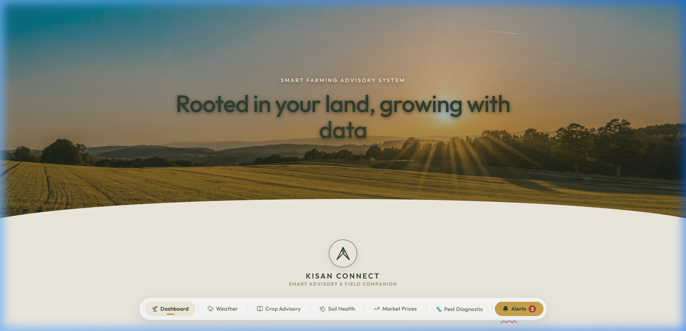
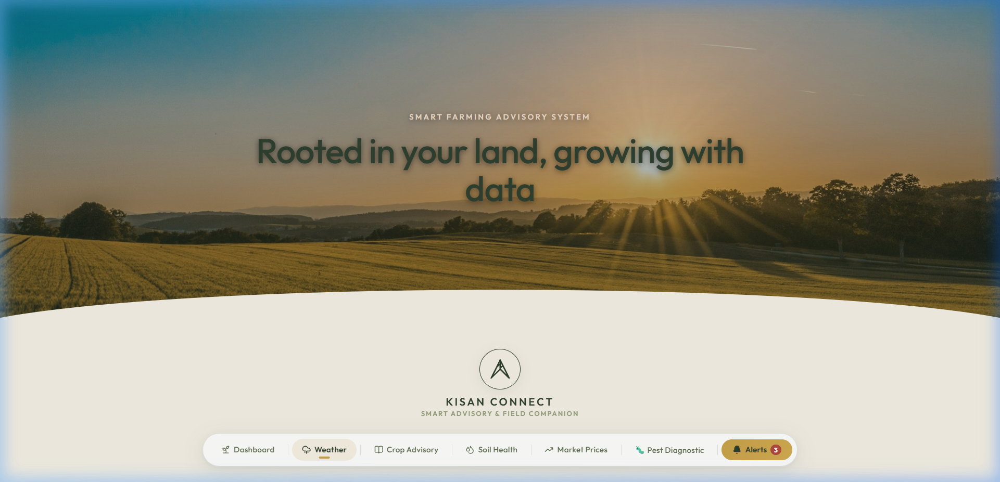
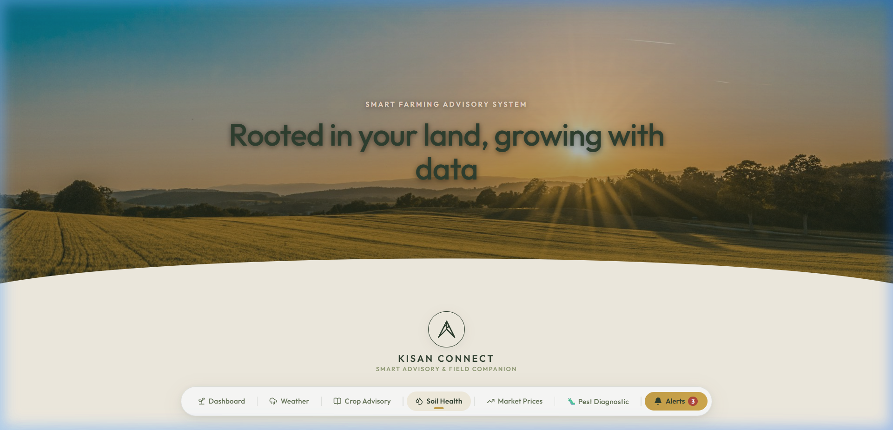
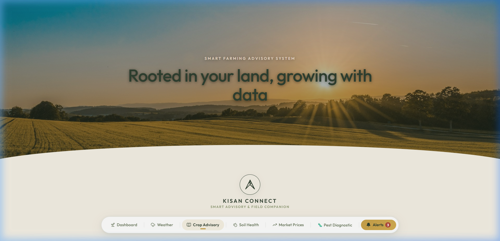
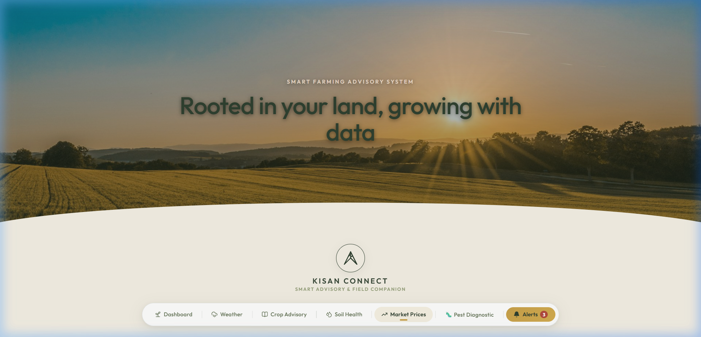
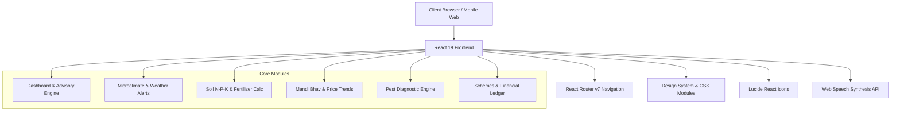

# 🌾 Kisan Connect — Smart Farming Advisory System

[](https://react.dev/)
[](https://vitejs.dev/)
[](https://reactrouter.com/)
[](LICENSE)
[]()

> **"Rooted in your land, growing with data."**  
> Kisan Connect is an end-to-end, hyper-local smart farming advisory platform designed to empower farmers with real-time agronomic insights, microclimate telemetry, pest diagnostics, market price trends (Mandi Bhav), soil health tracking, and government scheme management.

---

## 📋 Table of Contents
- [📸 Application Screenshots](#-application-screenshots)
- [✨ Key Features](#-key-features)
- [🏗️ System Architecture & Tech Stack](#️-system-architecture--tech-stack)
- [📁 Directory Structure](#-directory-structure)
- [🚀 Getting Started](#-getting-started)
- [♿ Accessibility & Inclusivity](#-accessibility--inclusivity)
- [🌐 Deployment](#-deployment)
- [🤝 Contributing](#-contributing)
- [📄 License](#-license)

---

## 📸 Application Screenshots

### 🌾 Main Dashboard & Real-Time Advisory


### 🌤️ Hyper-Local Weather Telemetry & Frost Alerts


### 🧪 Soil Health Gauge & N-P-K Fertilizer Calculator


### 🐛 Crop Protection & Pest Diagnostics


### 📈 Mandi Bhav & Sell / Hold Analytics


---

## ✨ Key Features

### 1. 🌾 Today's Smart Advisory & Audio Readout
- **Daily Agronomic Guidance:** Context-aware recommendations tuned to specific field locations (e.g., Karnal Wheat fields).
- **Text-to-Speech (TTS):** Integrated audio narration for low-literacy farmers to listen to advisories in their local dialect.
- **Urgent Action Triggers:** Real-time recommendations on irrigation depth, fertilizer timing, and frost protection.

### 2. 🌤️ Hyper-Local Weather Telemetry & Early Alerts
- **7-Day Field Outlook:** High-resolution predictions for temperature, precipitation probability, wind speed, and humidity.
- **Agricultural Alerts:** Automatic detection of frost risks and heavy rainfall (e.g., 45mm rain alerts), providing preventive action guidelines before spraying pesticides.

### 3. 🐛 AI Pest & Disease Diagnostics
- **Symptom Diagnostic Tool:** Interactive diagnostic wizard to identify wheat rust, bollworms, leaf blight, and aphid infestations.
- **Image Upload Simulation:** Upload leaf or crop photos to receive confidence-based diagnostics and recommended bio-pesticide treatments.

### 4. 🧪 Soil Health Gauge & Fertilizer Calculator
- **N-P-K Nutrient Analysis:** Visual breakdown of Nitrogen, Phosphorus, and Potassium levels alongside Organic Carbon and Soil pH.
- **Customized Dosages:** Precise fertilizer recommendations per acre to prevent over-use and soil degradation.

### 5. 📈 Mandi Bhav (Market Prices) & Sell/Hold Analytics
- **Live Commodity Prices:** Real-time Mandi price monitoring across local markets (Wheat, Paddy, Mustard, Cotton).
- **Sell vs. Hold Recommendations:** Algorithmic forecasting analyzing 30-day trends and Minimum Support Price (MSP) comparisons to maximize profit.

### 6. 📅 Full-Year Seasonal Planning Timeline
- **Crop Cycle Roadmap:** Interactive timeline spanning Kharif, Rabi, and Zaid seasons.
- **Milestone Tracking:** Step-by-step guidance from land preparation and seed sowing to irrigation schedules and harvesting.

### 7. 📜 Government Schemes & Financial Ledger
- **Subsidy Tracker:** Access and eligibility guidance for PM-KISAN, PM Fasal Bima Yojana (PMFBY), and Soil Health Card schemes.
- **Farm Financial Ledger:** Simple income & expense recorder to calculate net profit per crop cycle.

### 8. 🚜 Kisan Community & Equipment Rental Marketplace
- **Farmer Peer Network:** Community discussion board for sharing field insights, regional tips, and agricultural Q&A.
- **Equipment Sharing:** Local peer-to-peer rental marketplace for tractors, combine harvesters, rotavators, and sprayers.

### 9. 🌱 Sustainability Score & Eco-Farming Metrics
- **Environmental Index:** Gamified scoring system assessing water efficiency, organic inputs, and stubble management.
- **Actionable Eco-Tips:** Practical steps for carbon sequestration, crop rotation, and drip irrigation adoption.

---

## 🏗️ System Architecture & Tech Stack



### 🛠️ Core Technologies
- **Frontend Framework:** [React 19](https://react.dev/)
- **Build Tool & Dev Server:** [Vite 8](https://vitejs.dev/)
- **Routing:** [React Router v7](https://reactrouter.com/)
- **Icons:** [Lucide React](https://lucide.dev/)
- **Linting:** [Oxlint](https://github.com/oxc-project/oxc)
- **Styling:** Custom CSS Design Tokens with Glassmorphism, Responsive Grid Systems, and CSS Custom Properties.

---

## 📁 Directory Structure

```text
student-help/
├── public/                    # Static assets & screenshots
│   └── screenshots/           # Application preview screenshots
│       ├── dashboard.png
│       ├── weather.png
│       ├── soil_health.png
│       ├── crop_advisory.png
│       └── market_prices.png
├── src/
│   ├── assets/                # Images, illustrations, and SVG graphics
│   ├── components/            # Reusable UI Components & Modals
│   │   ├── CommunityFeed.jsx         # Peer discussion & equipment marketplace
│   │   ├── DataCollage.jsx           # Real-time multi-metric telemetry grid
│   │   ├── FarmProfileModal.jsx      # Farm profile configuration modal
│   │   ├── NotificationsDrawer.jsx   # Real-time alerts drawer
│   │   ├── PestDiagnosticModal.jsx   # AI pest diagnosis wizard
│   │   ├── PillNav.jsx               # Floating header navigation bar
│   │   ├── SchemesFinancePanel.jsx   # Subsidies & farm ledger panel
│   │   ├── SeasonalTimeline.jsx      # Annual crop planning calendar
│   │   ├── SmsWhatsappModal.jsx      # Instant SMS/WhatsApp subscription modal
│   │   ├── SustainabilityScore.jsx   # Eco-score & environmental metrics
│   │   ├── TodaysAdvisory.jsx        # Primary daily agronomic card with TTS
│   │   └── TopUtilBar.jsx            # Language, text scale, and accessibility toolbar
│   ├── pages/                 # Top-Level Page Views
│   │   ├── CropAdvisory.jsx          # Comprehensive crop protection & growth stages
│   │   ├── Dashboard.jsx             # Main agronomic dashboard hub
│   │   ├── MarketPrices.jsx          # Mandi prices & sell/hold analytics
│   │   ├── SoilHealth.jsx            # Soil quality, N-P-K & fertilizer calculator
│   │   └── Weather.jsx               # 7-day microclimate outlook & alerts
│   ├── App.jsx                # Root Component & Layout Shell
│   ├── App.css                # App-level styles & utility classes
│   ├── index.css              # Global CSS Design Tokens & Themes
│   └── main.jsx               # React Application Entrypoint
├── package.json               # NPM Dependencies & Scripts
├── vercel.json                # Single Page Application routing config for Vercel
├── vite.config.js             # Vite configuration
└── README.md                  # Project Documentation
```

---

## 🚀 Getting Started

### Prerequisites
Make sure you have the following installed on your machine:
- **Node.js** (v18.0.0 or higher recommended)
- **npm** (v9.0.0 or higher)

### Installation

1. **Clone the repository:**
   ```bash
   git clone https://github.com/Ankit-Raskar/Kisan-Connect.git
   cd Kisan-Connect
   ```

2. **Install dependencies:**
   ```bash
   npm install
   ```

3. **Start the development server:**
   ```bash
   npm run dev
   ```
   Open your browser and navigate to `http://localhost:5173`.

4. **Build for production:**
   ```bash
   npm run build
   ```

5. **Preview production build:**
   ```bash
   npm run preview
   ```

6. **Run linter:**
   ```bash
   npm run lint
   ```

---

## ♿ Accessibility & Inclusivity

Kisan Connect was built from the ground up to support farmers of diverse technical backgrounds:

- 🔊 **Voice Narration (SpeechSynthesis):** Single-click audio readouts for daily advisories, soil reports, and market updates.
- 👁️ **Low Literacy Visual Mode:** Simplified UI featuring prominent icon graphics and enlarged typography.
- 🌙 **Dusk / Night Mode:** Reduced glare color palette optimized for early morning or late night field inspections.
- 📱 **Mobile-First Responsive Layout:** Designed for seamless performance across low-cost mobile smartphones and tablets.

---

## 🌐 Deployment

The project includes a pre-configured [`vercel.json`](file:///c:/Users/Swapnil/OneDrive/Desktop/Ankit%20Project/.NEW%20HACKATHONS/student%20help/vercel.json) file for single-page application (SPA) routing.

To deploy on [Vercel](https://vercel.com/):
```bash
npx vercel
```

---

## 🤝 Contributing

Contributions are welcome! If you'd like to improve Kisan Connect:

1. Fork the Repository.
2. Create a Feature Branch (`git checkout -b feature/AmazingFeature`).
3. Commit your Changes (`git commit -m 'Add some AmazingFeature'`).
4. Push to the Branch (`git checkout -b feature/AmazingFeature`).
5. Open a Pull Request.

---

## 📄 License

Distributed under the **MIT License**. See `LICENSE` for more information.

---

<p center align="center">
  <strong>Crafted with ❤️ for the Agricultural Community</strong>
</p>
